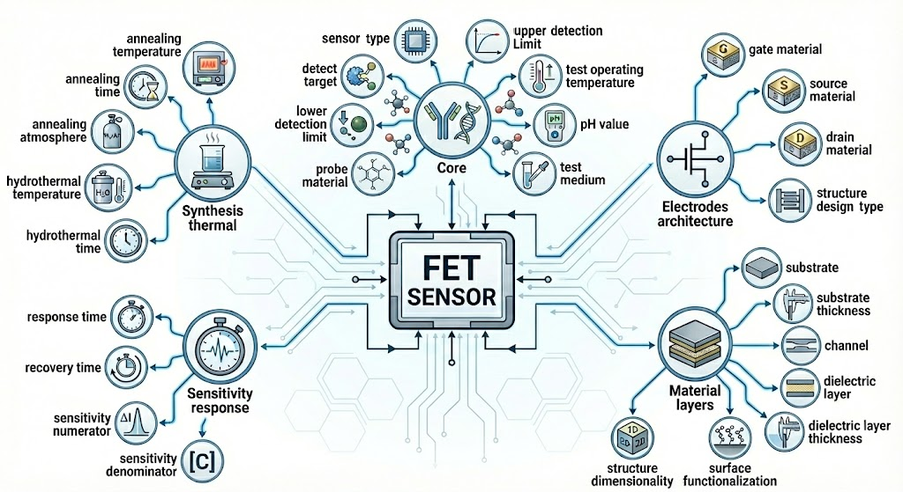

# T3: Text-Twin-Translation for FET Sensor Design

Reference implementation for the T3 agentic framework.

## Publication

- The first version of this work was a **spotlight** at the **ICLR 2026 AI4MAT** workshop: https://openreview.net/forum?id=eqBZpIAHGC&noteId=eqBZpIAHGC
- The paper has since been **accepted to the main conference of the KDD AI4S track**: https://openreview.net/forum?id=7QfGX651NZ

The full appendix is available here: [T3_appendix.pdf](T3_appendix.pdf).

## Overview

**FET Sensor Digital Twin:** Structured representation of 28 fields across 5 categories extracted from scientific literature.

<p align="center">
  
</p>

**LLM-based Information Extraction:** TextGrad optimization pipeline with autonomous prompt refinement.

<p align="center">
  
</p>

## Structure

```
T3_FET_sensor/
├── Part_I_Text/           # TextGrad prompt optimization
│   ├── textgrad_train.py
│   ├── textgrad_evaluate.py
│   └── prompts/
│
├── Part_II_Twin/          # Digital twin construction
│   ├── descriptor_query_tools/   # Material descriptor extraction
│   ├── data_augmentation/        # Physics-aware augmentation
│   ├── gnn_training/             # DTE-GNN model
│   └── sample_data/              # Anonymized samples
│
└── Part_III_Translation/  # Virtual screening & validation
    ├── gnn_inference/            # Inference pipeline
    └── dft_validation/           # DFT config generation
```

## Requirements

- Python 3.9+
- PyTorch, PyTorch Geometric
- RDKit, Transformers, ASE
